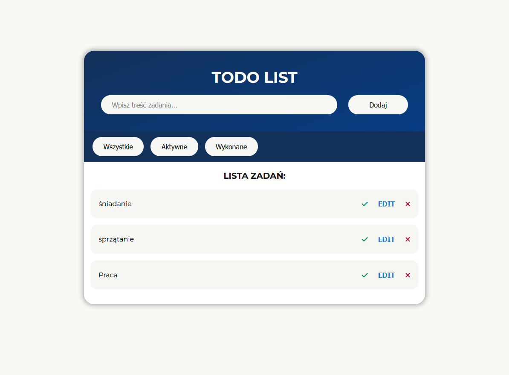

# Todo App 🗒️

Modern ToDo List application built with Vanilla JavaScript, HTML and CSS.
This project evolved from a simple task list into a more polished frontend application with:

- data persistence using localStorage
- task filtering
- popup-based editing
- responsive UI
- clean BEM naming convention



---

## 🔗 Live demo

https://flafii.github.io/js-mini-projects/toDoList

---

## 🛠 Tech Stack

- HTML5
- CSS3
- JavaScript (ES6+)
- Local Storage API
- Font Awesome
- BEM methodology

---

## ✨ Features

- Task management
  -- add task
  -- edit task
  -- delete task
  -- mark task as completed
- Persistence
  -- tasks saved in browser localStorage
  -- automatic data loading after page refresh
- Filters
  -- all tasks
  -- active tasks
  -- completed tasks
- UI / UX
  -- responsive layout
  -- popup edit modal with overlay
  -- hover and focus states
  -- mobile friendly filters and buttons

---

## 📂 Project structure (important files)

toDoList/
├── index.html
├── style.css
├── main.js
├── appPreview.png
└── readme.md

---

## ▶️ How to run locally

```bash
# clone
git clone https://github.com/FlaFii/militarized.git

# open
cd militarized
# open index.html in browser (or use live server extension)
```

## 💡 What I learned

This project was built mainly to improve practical frontend skills:

- DOM manipulation
- event delegation
- array methods (find, filter, forEach)
- state-based rendering
- localStorage with JSON.stringify() and JSON.parse()
- responsive design
- BEM naming convention
- UI refactoring and code cleanup

## ➕ Future Improvements

Possible next upgrades:

- inline SVG icons instead of Font Awesome kit
- drag & drop sorting
- due dates
- dark / light theme switch
- React version

## 👤 Author

FlaFii • https://github.com/FlaFii

Contact: mateusz.szymus7@gmail.com
